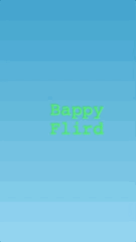

# Falppy Bird Clone with Phaser 3 JS

This is a clone of the "classic" mobile game [Flappy Bird](https://en.wikipedia.org/wiki/Flappy_Bird).

I built this starting from the tutorial [here](http://www.lessmilk.com/tutorial/flappy-bird-phaser-1). This tutorial uses Phaser 2 and builds everything into a single HTML file. While this is a great beginning tutorial I wanted to improve on the tutorial and dig deeper into Phaser. I converted the tutorial code to [Phaser 3](https://phaser.io/) and add Webpack with this [Webpack Phaser Starter Project](https://github.com/soggybag/phaser3-project-template).

## Phaser Resources 

- The [Phaser 3 Docs](https://photonstorm.github.io/phaser3-docs/)
- The [Phaser 3 Labs](https://labs.phaser.io)

### Requirements

You'll need [Node.js](https://nodejs.org) to install and run scripts and [npm](https://www.npmjs.com) to manage packages

## Install and run

Run next commands in your terminal:

| Command | Description |
|---------|-------------|
| `npm install` | Install dependencies and launch browser with examples.|
| `npm start` | Launch browser to show the examples.   Press `Ctrl + c` to kill **http-server** process. |

